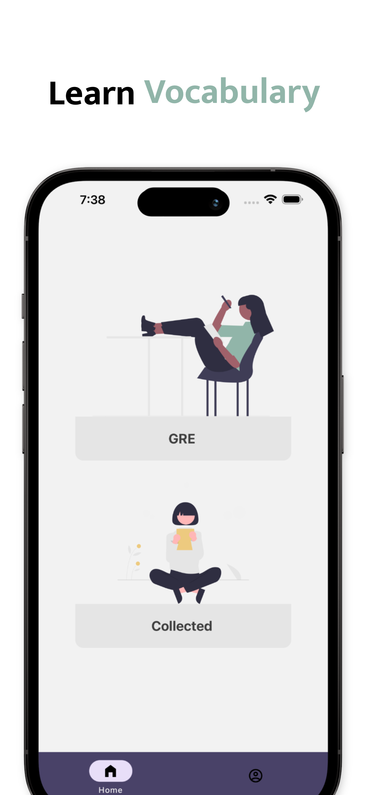
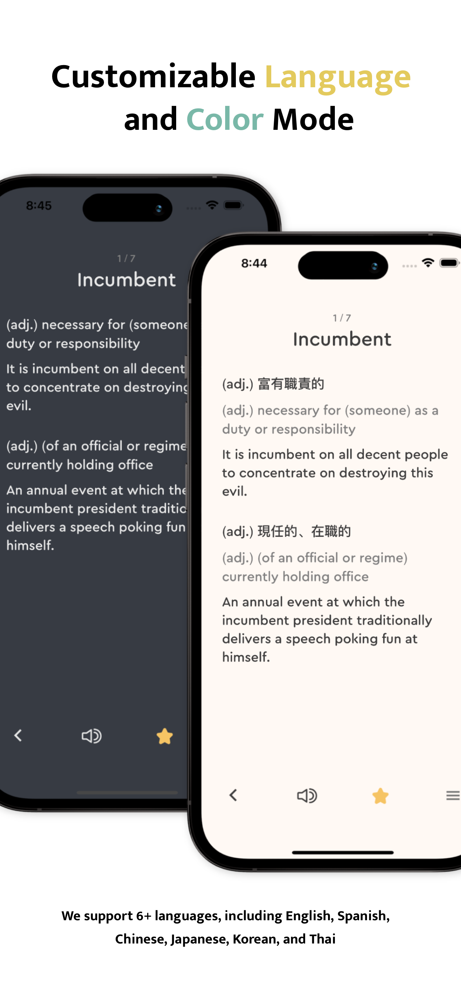
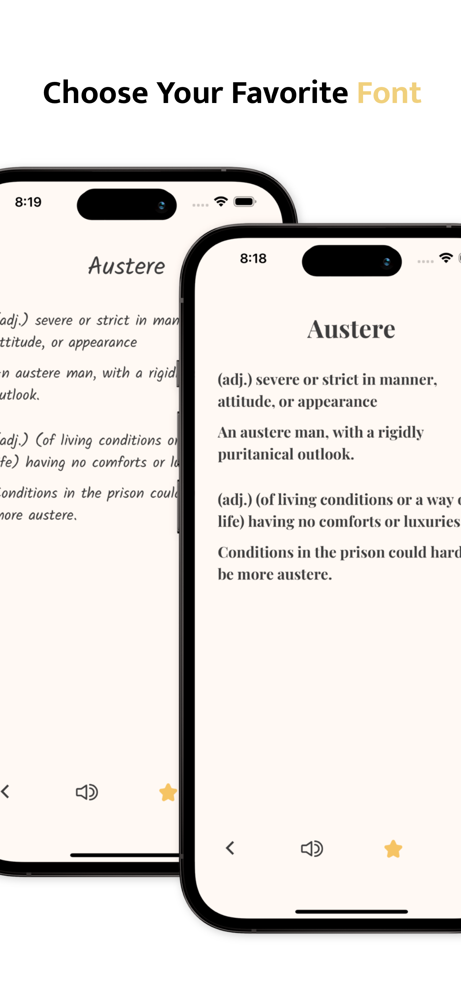
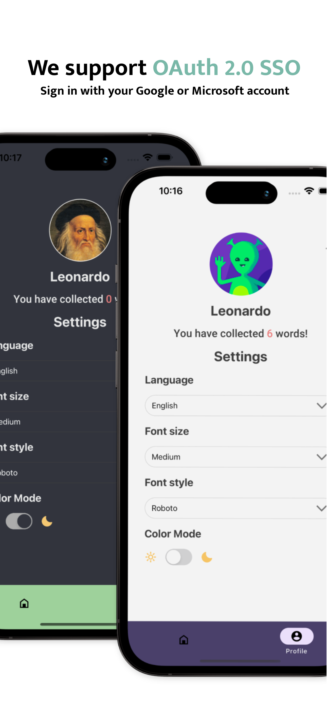

# VocaBoost - A GRE Vocabulary Learning APP

VocaBoost helps you improve your GRE vocabulary in an effective way. The APP is designed to help non-native English speakers improve their language skills and prepare for the GRE exam. With over 1500 of the most commonly used GRE vocabulary and phrases, VocaBoost is an essential tool for anyone looking to boost their English proficiency.

Available in English, Spanish, Chinese, Japanese, Korean and Thai. VocaBoost allows you to review vocabulary in your preferred language.

- View VocaBoost official website on [here](https://www.vocabularyboost.com/).
- Install VocaBoost extension on [Chrome Web Store](https://chrome.google.com/webstore/detail/vocaboost-gre-vocabulary/gfkmbmplhjdoejicgmaldndkcnnpplho).
- Install VocaBoost app on [App Store](https://apps.apple.com/app/vocabboost/id6447704480).

## Features

- Integrate with external Oauth services to perform authentication securely
- Upon successful login, the app synchronizes the user's saved words and preferences with the extension and store them in the app's database
- Real-time WebSocket functionality enables users to add or remove words from their collection with ease, without the need to reload the page
- 6+ language options which provide multilingual support to cater to users from different parts of the world
- Customizable font styles and light/dark mode to enhance user experience and readability
- Multiple sorting options, users can shuffle the list or sort alphabetically
- Integrate text-to-speech feature which allows users to improve their pronunciation skills by listening to the correct pronunciation of each word

## System Architecture

## Demo

 |  | 
:-:|:-:|:-:
 |  | 
